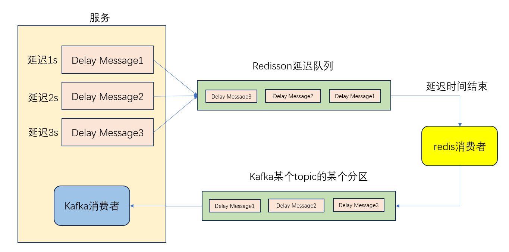

# 基于kaka-redisson延迟队列的实现

### 延迟队列介绍

延迟队列（Delay Queue）是一种消息队列的变体，它允许你延迟处理消息，即在一定的延迟时间后再将消息投递给消费者。延迟队列在很多场景下非常有用，比如实现定时任务、消息重试、超时处理等功能。

延迟队列通常由两部分组成：消息存储和消息投递。

消息存储：延迟队列会保存待处理的消息，以确保消息按照预定的延迟时间进行排序。每个消息都会带有一个时间戳，表示消息应该在何时被投递。

消息投递：一个定时任务或者后台处理程序会定期检查延迟队列中的消息，判断哪些消息已经到了投递时间，然后将这些消息发送给相应的消费者进行处理。

在实现延迟队列时，可以使用各种消息队列系统和技术，如 Redis、RabbitMQ、Kafka 等。实现延迟队列需要考虑多方面的因素，如消息的持久化、可靠性、并发处理等。在具体的场景中，可能需要根据需求进行一些调整和优化。

### 软件架构介绍

其实使用redis就可以单独实现延迟队列，有以下两种方案：

- 我们在使用redis存储时，可以添加过期时间，在键过期后，服务端收到redis的键过期通知处理相关业务。比如redis存储的是某个订单的id，过期后可以拿到这个id，查询数据库判断当前订单用户是否已经支付。这种方式需要进行配置。

  ```
  开启键空间通知： 在 Redis 配置文件（redis.conf）中启用键空间通知,这将启用所有键的过期事件通知
  notify-keyspace-events Ex
  ```

  这样，使用一些redis的客户端工具可以接收到键过期信息。

  这种方案的缺点是，它的过期通知是不稳定的（也就是说有可能我们不会收到redis的回调），而且如果redis的key很多时，延迟会比较高，严重影响性能。

- 使用redis的zset数据结构。 在 zset 中，每个成员都有一个分数（score），你可以根据分数来进行排序。利用 zset 的这个特性，你可以将消息的延迟时间作为分数，将消息的内容作为成员，从而实现延迟队列。以下是使用 Redis 的 zset 来实现延迟队列的一般步骤：

    1. **发布消息到延迟队列：** 当需要将消息延迟处理时，将消息的内容作为 zset 的成员，将消息的到期时间作为成员的分数，然后使用 Redis 命令 `ZADD` 将消息添加到 zset 中。
    2. **定时扫描和处理：** 在后台运行一个定时任务，定期扫描 zset，找出已到期的消息，然后将这些消息从 zset 中移除并将其发送给消费者进行处理。
    3. **消息消费：** 消费者从延迟队列中获取消息进行处理。如果消息处理失败或需要重新延迟处理，可以将消息重新添加到 zset 中。

redis的客户端redisson可以实现延迟队列的功能，在redisson的基础上，添加了中间件kafka，实现了一个延迟队列，理论上可以很大程度避免上述问题。

整体架构图：



### 接入手册

该组件导入相当简单，即插即用。

1.导入依赖

```java
        <dependency>
            <groupId>com.yang.delayqueue</groupId>
            <artifactId>delay-redisson-spring-boot-starter</artifactId>
            <version>1.0.0-SNAPSHOT</version>
        </dependency>
```

2.在服务启动类上添加注解@EnableDelayQueue

```java
@SpringBootApplication
@EnableDelayQueue
public class DelayQueueApplication {

    public static void main(String[] args) {
        SpringApplication.run(DelayQueueApplication.class,args);
    }
}
```

3.导入RedisDelayQueueMessageProducer的Bean对象

```java
    @Autowired
    private RedisDelayQueueMessageProducer redisDelayQueueMessageProducer;
```

4.调用sendMessage方法

```java
redisDelayQueueMessageProducer.sendMessage(Constant.QUEUE_CODE,order.getOrderId(),8,TimeUnit.SECONDS);
```


